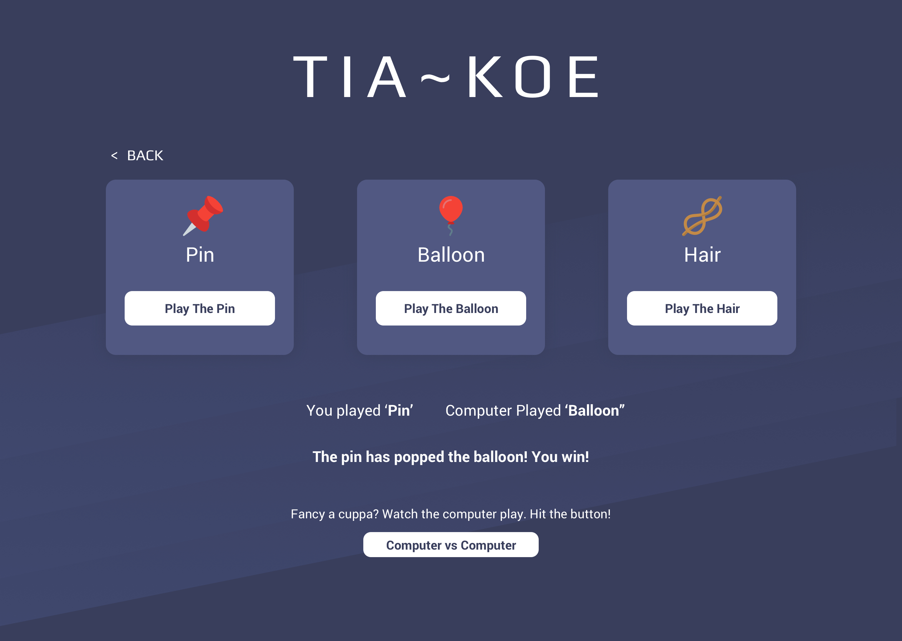

# TIA-KOE
&nbsp;

TIA-KOE is a random name given to my game involving the same concept as rock, papper, scissors.

To play the game and win, the process is the following: pin pops the balloon, balloon sticks to the hair and the hair wraps around the pin to win. 

The colour scheme used for this site are a simple contrast of purple colours as they fit nicely with the game and games tend to be a darker theme. The main body colour used is #383E5C with a background image over the top for a nice effect underneath the game tiles. The text is white so the contrast is ready to read from the body colour as well as the tile colour as they differ slightly but not enough to effect the readability. 

  
  

  
<h3>Link to Deployed Website</h3>

<a href="https://tomw2810.github.io/TIA-KOE/">TIA-KOE</a>
   
   

<h3>Responsive and Desktop Views<h3>
    

&nbsp;
  <h3>User Stories</h3>
   
<i>User One - A new user who wants to play a simple game whilst at lunch 
  User Two - A user who wants to learn a little more about the game 
  User Three - Someone who wants to watch the computer play against itself</i>

  <h4>User One:</h4>
  <li>Wants to play a game</li>
  <li>Googles 'quick game to play'</li>
  <li>Clicks on the link to the website taking you to the home page where the user gets a choice on options</li>
  <li>Clicks 'Play Game' to take them to the game page.</li>
  <li>Clicks on their choice to start the game and play against the computer</li>
  <li>Result comes in and its win, and the goal is go to 5 so they continue playing.</li>
  <li>They reach 5 first and decide to play another game to see if they can win again</li>

  <h4>User Two:</h4>
<li>Types in the URL of the games website</li>
<li>Takes you to the home page where the two home tiles are situated</li>
<li>Clicks on the 'About Game' to learn how to play the game and what it is about</li>
<li>Likes the sound of the game and decides to play the game</li>
  <li>Loves the game and tells their friends about it</li>

<h4>User Three:</h4>
  <li>Wants to watch the computer play first to see if the game is for them before playing</li>
<li>Clicks on the website link from Google or types in the URL to enter the website</li>
<li>Clicks 'Play Game' to take them to the game page</li>
<li>They see the computer button and press it to watch the game in action</li>
  &nbsp;
  

  &nbsp;
  <h3>Pages:</h3>

<h4>Home Page</h4>

The main home page has a h1 title clearly displayed in white against the purple background to define the name of the game. The two tiles which you can view on the page have been split into two sections; one for learning about the game and the other for exploring more about the game. Within the two sections we have defined buttons which have two commands taking you to either a game or more information on how the game came about. 

  

 <h4>About Game Page</h4>

On this page we have a simple tile with information on the game. It has a small decription of what the game involves and where the game came from.

    
  
<h4>Game Page</h4>

On the game page we have a more in depth page where we have a title of the game at the top. Below the title there is a back link to go back to the home page and choose another option for those unsure making easy to navigate. For this particular game we have three tiles with the three options: pin, balloon and hair. The aim  of the game is to beat the item that is vunerable to it. The pin will beat the balloon by popping it, the balloon will beat the hair by getting it stuck to the balloon becuase of static energy and the hair will beat the pin because it will wrap itself around the pin.

  
  &nbsp;

  <h3>Future Enhancements and Improvement of Features:</h3>

For the future versions I want to elaberate on the on screen activity. I feel in time this project can be brought to life with some cool animations as well as some  

  
  &nbsp;
  

  &nbsp;
  
  <h3>External Links for Image Usage</h3>
  
  <h4>Game Image #1</h4>
  
Sourced from flaticon.com 
  By Flaticon 
  <a href="https://www.flaticon.com/free-icon/knot_1777095">Link to Photo</a>

  <h4>Game Image #2</h4>
  
Sourced from flaticon.com 
  By Flaticon 
  <a href="hhttps://www.flaticon.com/free-icon/pin_889647">Link to Photo</a>

  <h4>Game Image #3</h4>
  
Sourced from unsplash.com 
  By Mockup Graphics 
  <a href="https://www.flaticon.com/free-icon/balloon_891010">Link to Photo</a>

  &nbsp;
  

  &nbsp;

  <h3>Languages and Technology</h3>
  <h4>Programming Languages</h4>
  <li>HTML</li>
  <li>CSS</li>
  <li>JavaScript</li>
  
  <h4>Technology</h4>
  <li>Github</li>
  <li>Google Chrome Developer Tools</li>
  
  <h4>Third Party Sites Used</h4>
  <li><a href="http://flaticon.com">Flaticon</a></li>
  &nbsp;
  <h3>Validator Tests<h3>
  <h4>HTML</h4>
  <li>Index - No Issues Found</li>
  <li>Seeds Pages - No Issues Found</li>
  <li>About Page - No Issues Found</li>
  <li>Contact Us Page - No Issues Found</li>

  <h4>CSS</h4>
  

  

  
 

  
  <h3>Bugs & Fixes</h3>
  <h4>Issue with </h4>
 
    
  <h3>Lighthouse Accesibilty</h3>
  <li>Performance - </li>
  <li>Accessibility - </li>
  <li>Best Practices - </li>
  <li>SEO - </li>
  
   
  

  <h3>Manual Testing</h3>
  <li>Mobile 320px</li>
  <li>Mobile 375px</li>
  <li>Mobile 425px</li>
  <li>Tablet 768px</li>
  <li>Laptop 1020px</li>
  
  

  <h3>Cross Browser Compatibility Check</h3>
  <li>Safari</li>
  <li>Firefox</li>
  <li>Google Chrome (Main Program)</li>
  

 
  
  <h4>Thanks for reading!</h4>
 
     
       
       
       
       
       
       
       
       
